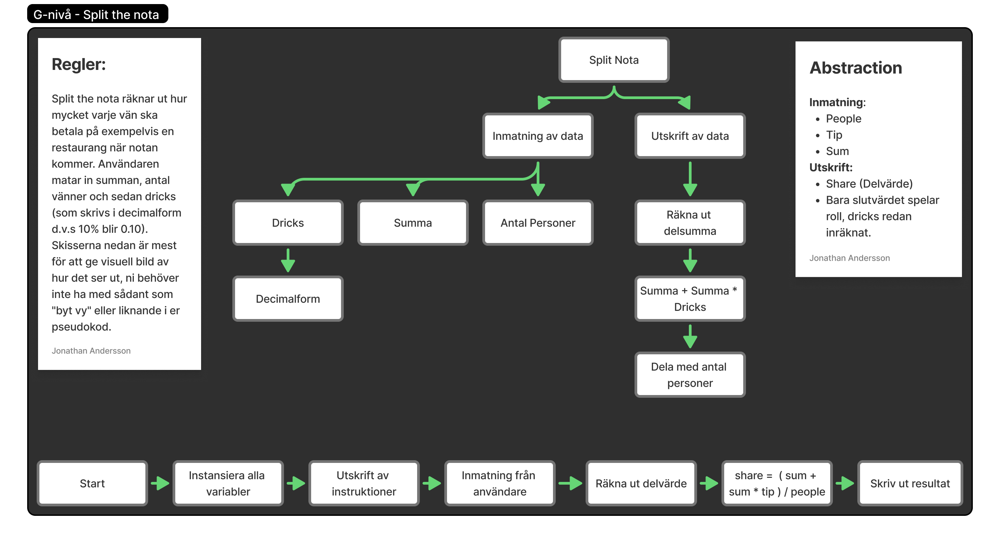

# Individuell Examination - Introduktion till programmering och datalogiskt tänkande

## G



### G - Code

```
SET sum = 0
SET tip = 0
SET people = 0
SET share = 0

PRINT "Skriv in Summa: "
INPUT CONVERT TO NUMBER(sum)

PRINT "Skriv in antal vänner: "
INPUT CONVERT TO NUMBER(people)

PRINT "Skriv in dricks (I decimalform, 10% blir 0.1): "
INPUT CONVERT TO NUMBER(tip)

share = (sum + sum * 0.1) / people
PRINT "Pris per person inklusive dricks är: " + share
```
